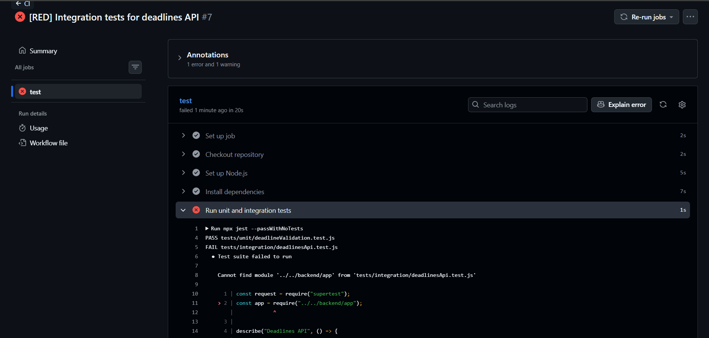
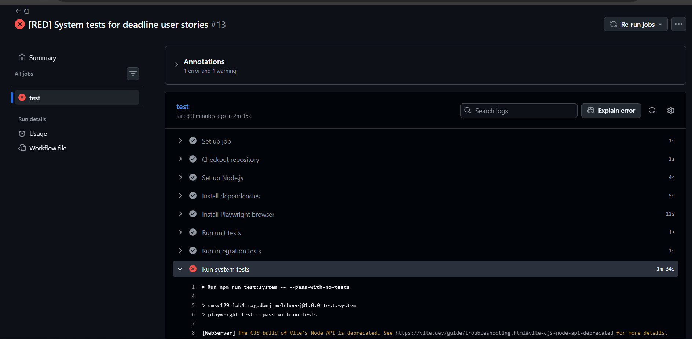
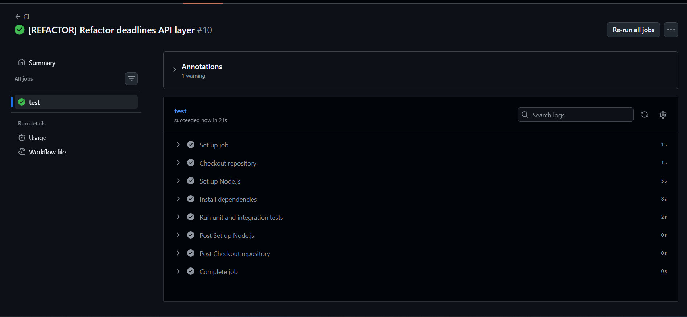
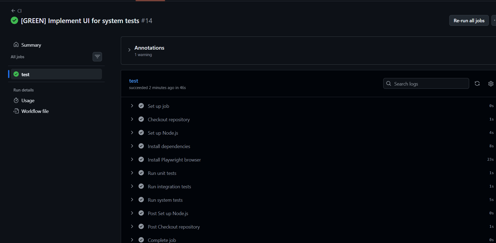
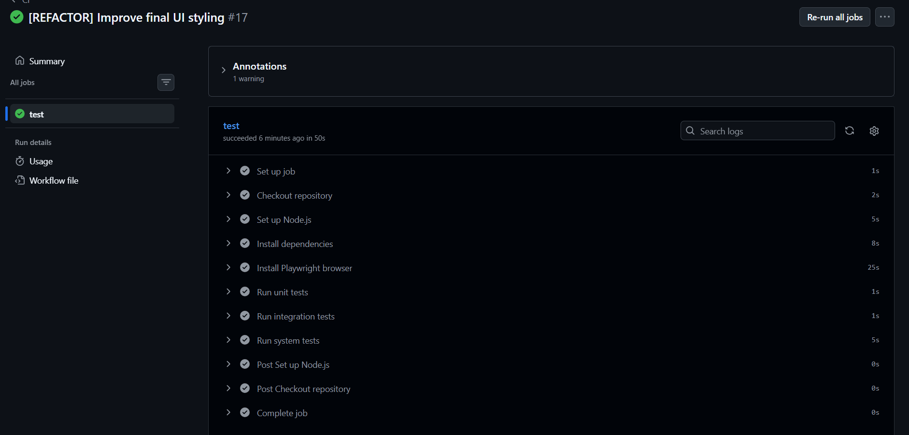
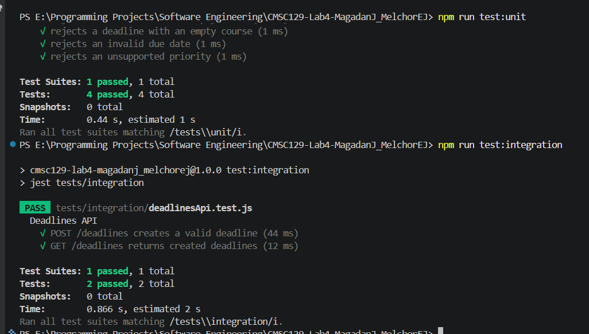
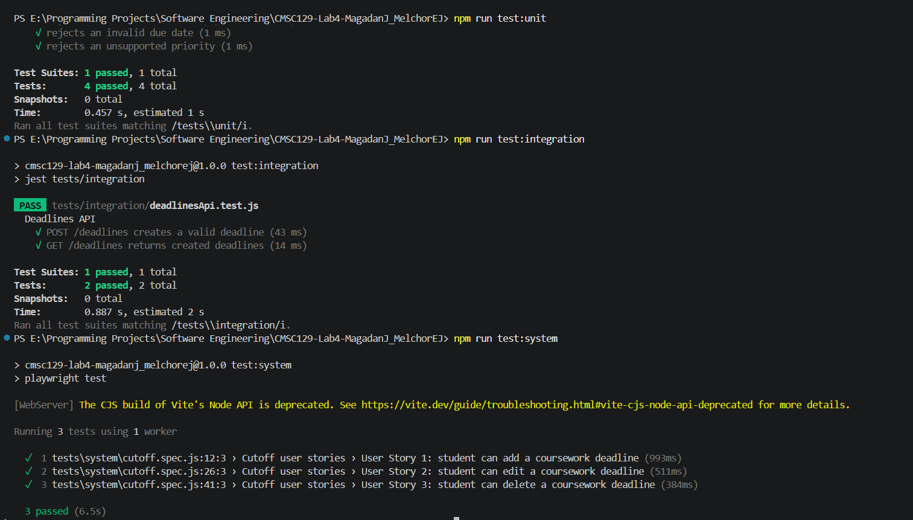
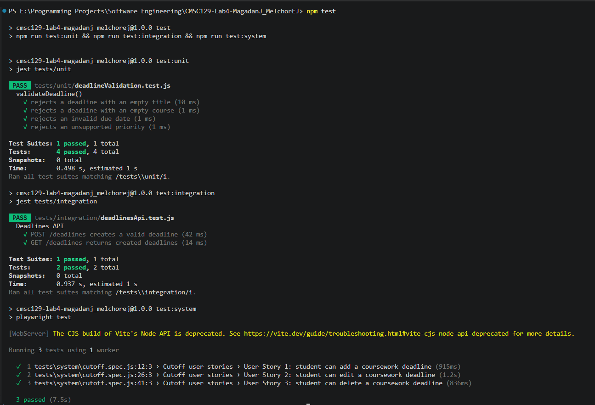

# Cutoff

CMSC 129 Lab 4: Test-Driven Development (TDD)
> Live URL: https://cutoff.onrender.com

Cutoff is a single-resource CRUD web application that helps students track academic deadlines before they pass. Users can add coursework requirements with a title, course, due date, and priority level, then update or delete them as plans change. The application is intentionally small so the project can focus on Test-Driven Development discipline across unit, integration, and system testing.

## User Stories

1. As a student, I want to add a coursework deadline, so that I can track upcoming academic requirements before their cutoff dates.
2. As a student, I want to edit a coursework deadline, so that I can keep my schedule accurate when requirements or dates change.
3. As a student, I want to delete a coursework deadline, so that I can remove requirements I no longer need to track.

## Tech Stack

- Frontend: React with Vite
- Backend: Node.js with Express
- Data storage: In-memory JavaScript array
- Unit testing: Jest
- Integration testing: Jest with Supertest
- System testing: Playwright
- CI/CD: GitHub Actions
- Deployment: Render, configured to deploy after GitHub Actions checks pass

## Testing Strategy

### Unit Tests

Unit tests will cover isolated deadline validation logic without HTTP requests, browser interaction, or storage dependencies. These tests will check that a deadline has a non-empty title and course, uses a valid due date, and uses one of the supported priority values: `low`, `medium`, or `high`.

This level catches business-rule errors before they reach the API or UI.

### Integration Tests

Integration tests will cover full Express request-response cycles using Supertest. The tests will exercise API routes together with the validation and in-memory data layer.

The first planned tests will verify that `POST /deadlines` creates a valid deadline and that `GET /deadlines` returns stored deadlines.

This level catches route wiring, response status, JSON shape, and data-flow problems.

### System Tests

System tests will use Playwright to verify the three user stories in a real browser. Each test will interact with the React UI the way a student would:

- adding a coursework deadline
- editing an existing coursework deadline
- deleting a coursework deadline

This level catches broken UI wiring, missing controls, and end-to-end workflow regressions.

## TDD Commit Plan

The project will follow the Red-Green-Refactor cycle required by the assignment.

| Part | Commit Prefix | Purpose |
| --- | --- | --- |
| Planning | `[DOCS]` | Initial README with app plan and testing strategy |
| Unit Red | `[RED]` | Add failing unit tests for deadline validation |
| Unit Green | `[GREEN]` | Implement minimum validation logic |
| Unit Refactor | `[REFACTOR]` | Clean up validation code while keeping tests passing |
| Integration Red | `[RED]` | Add failing API request-response tests |
| Integration Green | `[GREEN]` | Implement minimum Express API and store behavior |
| Integration Refactor | `[REFACTOR]` | Clean up route/store structure while keeping tests passing |
| System Red | `[RED]` | Add failing browser tests for the three user stories |
| System Green | `[GREEN]` | Implement minimum React UI and API wiring |
| System Refactor | `[REFACTOR]` | Final cleanup while all tests stay passing |
| Documentation | `[DOCS]` | Add test result screenshots, CI/CD evidence, deployment URL, and reflection |

## Setup Instructions

### Prerequisites

- Node.js 18 or newer
- npm
- Git

### Clone and Install

1. Clone the repo
```bash
git clone https://github.com/DualStackLabs/CMSC129-Lab4-MagadanJ_MelchorEJ.git
cd CMSC129-Lab4-MagadanJ_MelchorEJ
npm install
```

2. Run the Application Locally
```bash
npm run dev
```

The React frontend runs through Vite at `http://localhost:3000`, and the Express backend runs through Node.js at `http://localhost:3001`.

3. Run Tests
```bash
npm run test:unit
npm run test:integration
npm run test:system
npm test
```

## CI/CD Setup

GitHub Actions will be configured to run tests automatically on every push to main.

Red-phase commits are expected to show failing workflow runs because the tests are written before implementation. Green-phase commits are expected to show passing workflow runs after the minimum implementation is added.

Render is configured to deploy the application after GitHub Actions checks pass.

### CI/CD Evidence
#### Red Phase Evidence





#### Green Phase Evidence





#### Final Passing Pipeline



## Test Results
### Unit Test Results


### Integration Test Results


### System Test Results


### Full Test Suite Results


## Deployment

> Live URL: https://cutoff.onrender.com
```md
- Deployment platform: Render
- Deployment notes: Render builds the Vite frontend and serves it through the Express backend. Auto-deploy is configured to run after CI checks pass.
```


## Reflection

I am not used to starting small, so writing tests before the code felt like moving blindly at first. I could not see the finished output yet, and because I am still unfamiliar with testing, I did not fully trust the tests (I don't trust myself nor the AI) while writing them. It was tempting to build the whole app first, especially the UI, because that is the workflow I am more comfortable with. I was also constantly worried that I would create a crashing system or write tests that did not match the real requirements.

However, the TDD process forced me to break the project into smaller pieces. Instead of thinking about the whole application at once, I had to focus first on validation, then API behavior, then browser workflows. Writing tests first changed the design because the app naturally became more modular. The validation logic, Express routes, data store, and UI behavior were separated because each test level needed a clear target. Even though this project was AI-assisted, following Red-Green-Refactor helped me understand why each part existed instead of only copying code until the app worked.


# Members
- Magadan, Jasmine
- Melchor, Eleah Joy