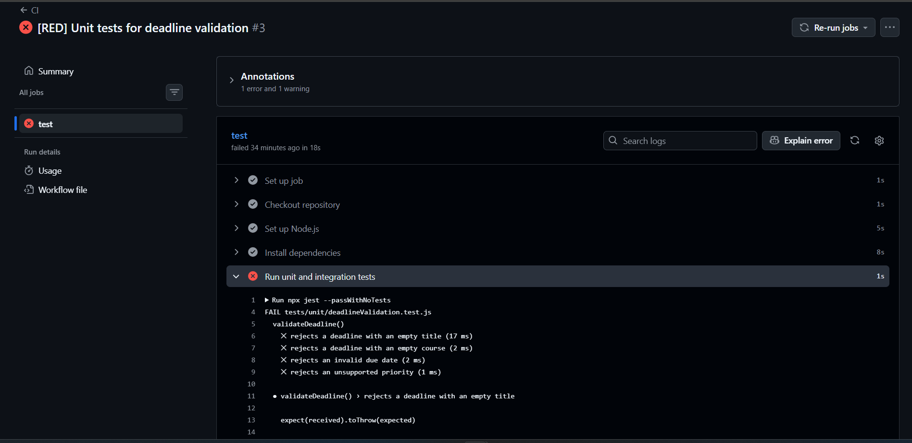
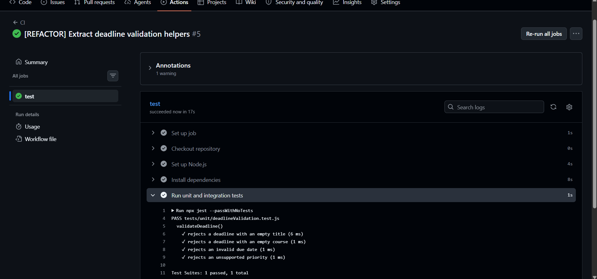
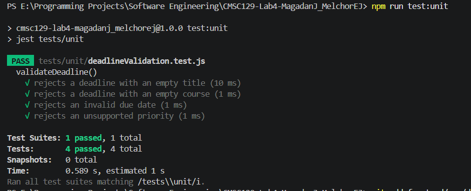

# CMSC 129 Lab 4: Test-Driven Development (TDD)
# Cutoff
> Live URL: To be added after deployment.

Cutoff is a single-resource CRUD web application that helps students track academic deadlines before they pass. Users can add coursework requirements with a title, course, due date, and priority level, then update or delete them as plans change. The application is intentionally small so the project can focus on Test-Driven Development discipline across unit, integration, and system testing.

## User Stories

1. As a student, I want to add a coursework deadline, so that I can track upcoming academic requirements before their cutoff dates.
2. As a student, I want to edit a coursework deadline, so that I can keep my schedule accurate when requirements or dates change.
3. As a student, I want to delete a coursework deadline, so that I can remove requirements I no longer need to track.

## Tech Stack

- Frontend: React with Vite
- Backend: Node.js with Express
- Data storage: In-memory JavaScript array
- Unit testing: Jest
- Integration testing: Jest with Supertest
- System testing: Playwright
- CI/CD: GitHub Actions
- Deployment: To be deployed on a free-tier platform after all tests pass

## Testing Strategy

### Unit Tests

Unit tests will cover isolated deadline validation logic without HTTP requests, browser interaction, or storage dependencies. These tests will check that a deadline has a non-empty title, uses a valid due date, and uses one of the supported priority values: `low`, `medium`, or `high`.

This level catches business-rule errors before they reach the API or UI.

### Integration Tests

Integration tests will cover full Express request-response cycles using Supertest. The tests will exercise API routes together with the validation and in-memory data layer.

The first planned tests will verify that `POST /deadlines` creates a valid deadline and that `GET /deadlines` returns stored deadlines.

This level catches route wiring, response status, JSON shape, and data-flow problems.

### System Tests

System tests will use Playwright to verify the three user stories in a real browser. Each test will interact with the React UI the way a student would:

- adding a coursework deadline
- editing an existing coursework deadline
- deleting a coursework deadline

This level catches broken UI wiring, missing controls, and end-to-end workflow regressions.

## TDD Commit Plan

The project will follow the Red-Green-Refactor cycle required by the assignment.

| Part | Commit Prefix | Purpose |
| --- | --- | --- |
| Planning | `[DOCS]` | Initial README with app plan and testing strategy |
| Unit Red | `[RED]` | Add failing unit tests for deadline validation |
| Unit Green | `[GREEN]` | Implement minimum validation logic |
| Unit Refactor | `[REFACTOR]` | Clean up validation code while keeping tests passing |
| Integration Red | `[RED]` | Add failing API request-response tests |
| Integration Green | `[GREEN]` | Implement minimum Express API and store behavior |
| Integration Refactor | `[REFACTOR]` | Clean up route/store structure while keeping tests passing |
| System Red | `[RED]` | Add failing browser tests for the three user stories |
| System Green | `[GREEN]` | Implement minimum React UI and API wiring |
| System Refactor | `[REFACTOR]` | Final cleanup while all tests stay passing |
| Documentation | `[DOCS]` | Add test result screenshots, CI/CD evidence, deployment URL, and reflection |

## Setup Instructions

### Prerequisites

- Node.js 18 or newer
- npm
- Git

### Clone and Install

1. Clone the repo
```bash
git clone <repository-url>
cd CMSC129-Lab4-MagadanJ_MelchorEJ
npm install
```

2. Run the Application Locally
```bash
npm run dev
````

The React frontend will run through Vite, and the Express backend will run through Node.js. Exact local ports will be finalized once the implementation is added.

3. Run Tests
```bash
npm run test:unit
npm run test:integration
npm run test:system
npm test
```

## CI/CD Setup
GitHub Actions will be configured to run tests automatically on every push to main.

Red-phase commits are expected to show failing workflow runs because the tests are written before implementation. Green-phase commits are expected to show passing workflow runs after the minimum implementation is added.

Deployment will be configured to proceed only after the test workflow passes.

### CI/CD Evidence
### Red Phase Evidence



### Green Phase Evidence



- Final passing pipeline screenshot: To be added.

## Test Results
### Unit Test Results


2. Integration Test Results
Screenshot of passing integration tests: To be added after Part 2.

3. System Test Results
Screenshot of passing system tests: To be added after Part 3.

4. Full Test Suite Results
Screenshot of full passing test suite: To be added after final implementation.

5. Deployment
    - Live deployment URL: To be added.
    - Deployment notes: To be added after the application is deployed.


# Members
- Magadan, Jasmine
- Melchor, Eleah Joy